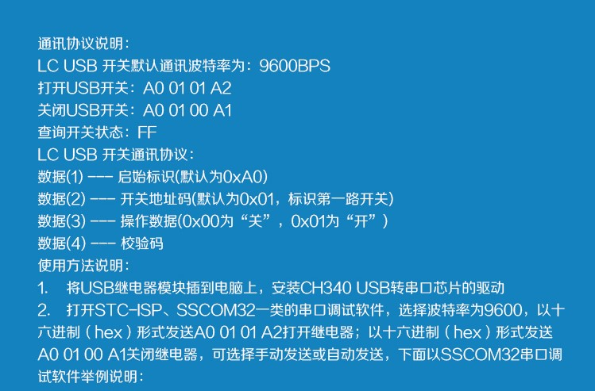

# py-usb-relay
python code for LCUS USB relay module
控制 LCUS USB 繼電器的 python 程式碼

LCUS 是一個非常容易取得且便宜免驅動的 USB 繼電器，透過通用的串列埠界面，可以用來整合進 CI, CD 的流程中，也可以遠端控制開關。

## Usage:
```
python ./main.py --com-port com8 --id 1 --action on
```

### 參數說明:
* `--com-port`: USB 繼電器所在的串列埠，可從「裝置管理員看到」
* `--id`: LCUS 有多個繼電器的產品，用來指定是哪一顆，從 0 起算
* `--action`:
  * `on`: 打開 (NO->斷路、NO->導通)
  * `off`: 關閉 (NC->導通、NO->斷路)
  * `click`: 按一下 (on 0.5 秒後切換成 off)

## Tested
* LCUS-1: 1路繼電器 http://www.lctech-inc.com/cpzx/2/jdqmk/2019/0111/62.html <br>

* LCUS-2: 2路繼電器 http://www.lctech-inc.com/cpzx/2/jdqmk/2021/0825/508.html

## License
`py-usb-relay` 採用 MIT 授權，中文翻譯可參考 http://lucien.cc/20080117-the-mit-license
